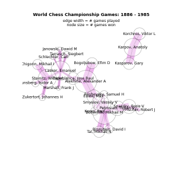

#GovHack Toolkit
Welcome to the GovHack toolkit. This page provides all the information you need to prepare hackfest entries.
These tools can be used to make entries like mobile apps, web apps and data visualisations/infographics.

The text of this toolkit is open for reuse under a Creative Commons Attribution licence and improvements are encouraged via Git http://github.com/maxious/govhack-tools or via email patches to govhack@lambdacomplex.org

# How to register and submit your entry
## Registering your team
Coming Soon: how to use the website "Hacker Space" to register and find teams.

## Preparing your submission

You should record a 3 minute speech and mix images/text to accompany.
http://www.screenr.com/ and other screencasting tools allow you to demo apps.
To mix together clips, you can use youtube video editor http://www.youtube.com/editor or local software like http://www.videolan.org/vlmc/ or http://www.lwks.com/

You also need to submit your "source material". For an application this may be source code, for another work it might be your notes or prototypes.
The key thing here is that your source material demonstrates to the judges that some of the end result was your own work and that it is possible for another person to replicate that work.

# General References {#general-data-hacking-and-programming-references}

## The basics of being a data scientist

*   Have a hypothesis - even if you're making a tool/api that helps people with their questions too, remember what the objective of that is.
*   Find the people and tools you need to prove/show/find. This rest of this page will help with the latter.
*   Analyse and present results -  were they what you expected? Do they help explain to others what you have found out?
Can present as a interactive data visualisation or a web/mobile application or just a infographic/motion graphics video that tells a story.

</dt>
Illustration from Data Journalism Handbook, CC BY-SA 3.0</dd>

The best high level reference is the 'Understanding Data' and 'Delivering Data' chapters of the Data Journalism Handbook which is available online for free at
[datajournalismhandbook.org](http://datajournalismhandbook.org/)

You can learn the technical skills from scratch in Visualize This: The FlowingData Guide to Design, Visualization, and Statistics by Nathan Yau or for more advanced
practical advice check out Data Analysis with Open Source Tools by Philipp K. Janert
For further reading in this space
[http://flowingdata.com/2012/04/27/data-and-visualization-blogs-worth-following/](http://flowingdata.com/2012/04/27/data-and-visualization-blogs-worth-following/)

**Statistics**

A great guide to statistics is 
[Think Stats](http://greenteapress.com/thinkstats/html/index.html)

**Programming**

Programming is valuable skill for manipulating and displaying data.
Basic tutorials for a variety of languages are available for free online or you can learn interactively with websites like [Codecademy for JavaScript](http://www.codecademy.com/#!/exercises/0), [Learn Python](http://www.learnpython.org/) or [Try Ruby](http://tryruby.org/)

For web applications and visualisations, you'll need a basic understanding of JavaScript in order to configure pre made libraries like jQuery. A good source for Javascript information is the [Mozilla Development Network Javascript Page](https://developer.mozilla.org/en/JavaScript)

**Accessibility/User Experience**

Following accessibility guidelines not only make a application accessible but make it a better experience for all users! Even if not making an app, good to consider these things to do and not do when designing for humans: [http://www.w3.org/TR/WCAG/](http://www.w3.org/TR/WCAG/)

# Developer Tools For Your Computer {#developer-tools-for-your-computer}
No matter what kind of application you have for the data, there are many tools you can use to better collaborate and manage your project.

### Source Control 
Using a version control system like Git or Subversion allows you to keep many different versions of what you have been working on so you can collaborate with others or simply back up your files so you don't lose them!

[tutorials on git](http://progit.org/book/) and
[GUIs to help you](http://code.google.com/p/tortoisegit/)

[manual for Subversion](http://svnbook.red-bean.com/)
and a [similar GUI for Subversion](http://tortoisesvn.net/)

### Task Tracking

Issue/task trackers allow you to outline the tasks required for your project and assign them to people to do.

[Trello](https://trello.com/) and [Workflowy](https://workflowy.com/) are free, lightweight project management tools suitable for a rapid project!

## Hosted Developer Tools {#hosted-developer-tools}

Can get many tools (source control, issue tracking) combined into one service cloud hosted so there's no setup required.

### Github
Git obviously but svn/hg interfaces are also available. Provide their own GUI for Windows/OSX or use a variety of Git capable tools

### Sourceforge

Subversion, Git, Mercurial, Bazaar, CVS, issue tracker, wiki, release file downloads. Unlimited free use for open source projects.

You can create your own Sourceforge project at [http://sourceforge.net/](http://sourceforge.net/)

### Google Code Project Hosting

Git, Mercurial, and Subversion code. Issue tracker, wiki, release file downloads. Unlimited free use for open source projects.

You can host your Google Code project and get access to developer tools, APIs and documentation at [http://code.google.com/](http://code.google.com/)

# Applications of data hacking

## API Development {#api-development}

So an API isn't just an XML file  

A good web based data API:

*   Is logically organised
*   Can filter returned data
*   Can return results in different open formats (CSV/JSON etc.)
*   Is efficient and responsive by using caching and databases appropriately
*   Handles errors gracefully
*   Monitors and controls access (to show benefit realised of API and prevent abuse)
*   Provides appropriate documentation with examples

Some people like sensis [http://](http://developers.sensis.com.au/)[developers.sensis.com.<wbr>au</wbr>](http://developers.sensis.com.au/)[/](http://developers.sensis.com.au/) use a provider like[http://](http://mashery.com/)[mashery.com](http://mashery.com/)[/](http://mashery.com/) or [https](https://apigee.com/)[://](https://apigee.com/)[apigee.com](https://apigee.com/) or [http://](http://apiaxle.com/)[apiaxle.com](http://apiaxle.com/)[/](http://apiaxle.com/) or [http://www.3scale.net/](http://www.3scale.net/) which handles making a good API for them.

Atlassian have a great page on what makes a good API https://developer.atlassian.com/display/REST/Atlassian+REST+API+Design+Guidelines+version+1)

HowTo.gov has a bunch of api resources about choosing SOAP vs. REST etc. http://www.howto.gov/mobile/apis-in-government

API documentation is important too! Traditionally for SOAP APIs, you use WSDL but for REST try [Swagger](http://swagger.wordnik.com/) or [iodocs](https://github.com/mashery/iodocs)
Many web app frameworks can generate the documentation for you. For example Symfony for PHP http://symfony.com/ https://github.com/FriendsOfSymfony/FOSRestBundle http://williamdurand.fr/2012/08/02/rest-apis-with-symfony2-the-right-way/ https://github.com/nelmio/NelmioApiDocBundle

 better apis https://github.com/liip/LiipHelloBundle
      - or for Rails https://github.com/elc/rapi_doc https://github.com/Pajk/apipie-rails

   http://amberonrails.com/building-stripes-api/

example WeatherTree weather API

## Infographics and Data Visualisation {#data-visualisation}

Infographics try to contextualise charts and graphs to tell a story. Data vis builds on this to find new ways to design insight.

Most of the categories to follow have visualisation tools specific to their purpose.

You can find some data visualisation tools below:

[http://www.visualisingdata.com/index.php/2011/07/part-6-the-essential-collection-of-visualisation-resources/](http://www.visualisingdata.com/index.php/2011/07/part-6-the-essential-collection-of-visualisation-resources/)

Also check out [http://thejit.org](http://thejit.org/) &amp; [http://www.senchalabs.org/<wbr>philogl/</wbr>](http://www.senchalabs.org/philogl/) (contributed by Matt Adcock)

Have to use visual art concepts, good color schemes http://www.r-bloggers.com/the-paul-tol-21-color-salute/

    - https://graphics.stanford.edu/wikis/cs448b-12-fall/ data viz theory
    - http://drawingbynumbers.org/toolsandresources

examples    - http://sunfoundation.tumblr.com/
### The Open Budget

tools     - http://selection.datavisualization.ch/ data viz tools catalog

## Web Applications

With the rise of HTML5 technologies it is easier than ever to make a web application for engaging use of data.

    - css framework like bootstrap or zurb foundation
- css gauges http://www.larentis.eu/donuts/
- bootstrap themes, web fonts, css sprites, icon fonts
  - http://designmodo.com/flat-free/ http://designmodo.github.com/Flat-UI/

### Examples

#### PlanningAlerts

Description: Planning Alerts takes data from local government development applications and sends alerts to users based on what applications are lodged in their area.

Programming Language: Ruby

Source Control: [Git](https://github.com/openaustralia/planningalerts-app)

Issue Tracking: [Atlassian JIRA](http://tickets.openaustraliafoundation.org.au/browse/PA/)

#### LobbyLens

Description: Displays connections between government contracts, business details, politician responsibilities, lobbyists, clients of lobbyists, political donors and the location of these entities.

Programing Language: PHP

Source Control: SVN (Subversion)

Issue Tracking: A whiteboard

#### bus.lambdacomplex.org

Description: Online Canberra Bus Timetables and Trip Planner.

Programing Language: PHP/Ruby

Source Control: Git

Issue Tracking: Github

## Mobile

Frameworks, http://www.sencha.com/products/touch http://phonegap.com/ http://cordova.apache.org/

html5 jquery mobile like directory.gov.au

For data visualisation, there are a variety of graph widgets http://code.google.com/p/afreechart/ http://code.google.com/p/snowdon/ http://code.google.com/p/chartdroid/ http://androidplot.com/ http://code.google.com/p/achartengine/

Backend frameworks http://helios.io/ https://www.parse.com/
### Examples

bom water,

nz gov budget

# Geographical Data Tools {#geographical-data-tools}

Check out the[ GeoRabble Boundary Mapper's Cookbook](http://georabble.org/2012/05/31/the-boundary-mappers-cookbook/) to see how you can tie all these things together!

## Key datasets
          - base layers like agri http://agri.openstreetmap.org/, http://irs.gis-lab.info/ wms or http://www.gdal.org/frmt_wms_openstreetmap_tms.xml
           ASGS including suburbs/postcodes
                   - andrewharvey4.wordpress.com postgis/asgs tutorial
## Wrangling

### Converting
There are many spatial data formats and often the one your tool requires is not the one the dataset is provided in
Online
  - http://converter.mygeodata.eu/vector kml exporter for shp
or locally using GDAL

### Geocoding
cloudmade, google (but you must display on a Google Map).

Easiest way to do is with a Google Spreadsheet/Fusion Table http://williamparry.blogspot.com.au/2011/04/putting-data-into-google-fusion-tables.htm http://support.google.com/fusiontables/answer/1012281?hl=en&ref_topic=2592806

## Analysis

### PostGIS

PostGIS is an extension for the PostgreSQL database server that allows you to store and manipulate geospatial data on a large scale. For example finding which points are in an area or what points are closest . It is also very useful for storing geospatial data because it can convert between all major formats including ESRI Shape files and Google Earth/Maps KML.

### Quantum GIS

QGIS is a graphical desktop application that allows viewing and editing of geospatial data. Some good base maps are available by adding the WMS layer/server [http://irs.gis-lab.info/](http://irs.gis-lab.info/)

## Visualisation

### Layar and other augmented reality tools

### Google Fusion Tables/ChartsBin/[OpenHeatMap](http://www.openheatmap.com/)

Input numerical values and areas to a spreadsheet and maps are produced where the areas are colored on a scale of the values

http://www.peteraldhous.com/CAR/Making_maps_with_Google_Fusion_Tables.pdf tutorial or http://support.google.com/fusiontables/topic/2592754?hl=en&ref_topic=27020 for google help files

### [Cartographer.js](http://cartographer.visualmotive.com/)

Input data as JSON and maps are produced.
See also d3 maps.
  - http://bost.ocks.org/mike/map/

### OpenLayers/Google Maps/[Leaflet](http://leaflet.cloudmade.com/)

Display points and different layers. Leaflet is the easiest to use if you just want to show points with popups when clicked on.
There are wrappers for Google maps like http://hpneo.github.com/gmaps/examples.html and Mapstraction that can make it easier to use too.

### NASA World Wind/Google Earth

Google Earth provides 3\. viewing of KML/GML files which represent points and shapes, both through a desktop application and a web plugin. These can be extended with interactive features that allow you to view by timeline or have animated tours between different points. You can also develop and customise your own viewer with the open source [NASA World Wind toolkit.](http://goworldwind.org/demos/)

### 

# Tabular Data Tools {#tabular-data-tools}

## Wrangling

Converting formats json/xml/csv etc.
  - http://shancarter.com/data_converter/

Tabular data may have duplicate entries or incorrect formats (varying ways to enter dates/phonenumbers etc.). There are tools to quickly fix common problems

[DataWrangler](http://vis.stanford.edu/wrangler/)/[Google Refine](http://code.google.com/p/google-refine/)

Clean up duplicate or inconsistent data entries.

Can also use general purpose tools; grep/awk/sed
regex http://www.regexper.com/ http://www.debuggex.com/?re=&str=

## Analysis

### Excel / Google Docs

Great basic analysis and viewing. Older versions can be limited to 6500\. or so rows. Eg [http://www.tcij.org/training-material/car/data-mining/3474](http://www.tcij.org/training-material/car/data-mining/3474)

http://training.sunlightfoundation.com/module/data-visualizations-google-docs/

### PostgreSQL/MySQL

Next step up, large datasets can be manipulated/extracted efficiently for example [http://www.postgresql.org/docs/8.4/static/tutorial-window.html](http://www.postgresql.org/docs/8.4/static/tutorial-window.html) , no built-in data visualisation though.

### R Statistical Language

Advanced data analysis, can find and visualise trends in large datasets. Some reference resources to learn the language [http://cran.r-project.org/doc/manuals/R-intro.html ](http://cran.r-project.org/doc/manuals/R-intro.html)There are also some addons that provide graphical interfaces that make it easier to use such as Rattle [http://rattle.togaware.com/](http://rattle.togaware.com/) , RStudio [http://rstudio.org/](http://rstudio.org/) or Deducer [http://www.deducer.org/pmwiki/pmwiki.php?n=Main.DeducerManual](http://www.deducer.org/pmwiki/pmwiki.php?n=Main.DeducerManual)

  - http://blog.yhathq.com/posts/10-R-packages-I-wish-I-knew-about-earlier.html
        - excel -> R/rattle/ deducer? http://www.r-bloggers.com/updates-to-the-deducer-family-of-packages/
    - http://www.twotorials.com/ for R
      - http://www.r-bloggers.com/gradient-word-clouds/ http://www.rstudio.com/shiny/ http://blog.ouseful.info/2012/11/28/quick-shiny-demo-exploring-nhs-winter-sit-rep-data/ https://github.com/timelyportfolio/shiny-d3-plot https://github.com/trestletech/shiny-sandbox/tree/master/grn
         - http://www.r-bloggers.com/video-simpler-tricks-and-tools-help-debugging-git-latex-and-workflow-with-r-by-prof-rob-hyndman/
      - http://yihui.name/knitr/ makes reports including google widgets/charts/maps via http://www.r-bloggers.com/googlevis-0-3-2-is-released-better-integration-with-knitr/
      - http://chartsnthings.tumblr.com/post/36978271916/r-tutorial-simple-charts http://flowingdata.com/2012/12/17/getting-started-with-charts-in-r/
      
      http://www.r-bloggers.com/to-plot-them-is-my-real-test/
                               http://blog.revolutionanalytics.com/2013/04/visualize-large-data-sets-with-the-bigvis-package.html 10 Million Points in 5 seconds.

## Visualisation

### [Tableau Desktop](http://www.tableausoftware.com/)

Create visualisations from various data formats by dragging and dropping. Free trial available on website. 

### Web page (Javascript) graphs
[Flotr2](http://www.humblesoftware.com/flotr2/)/[Google Chart Tools](https://developers.google.com/chart/)
Javascript based charts for webpages.
http://www.polychartjs.com/ Allows facetting and easy use of JSON data sets.

### D3.js (Data-Driven Documents)

Javascript visualisations that are more interactive or intricate than charts. Can be hard to learn but there are examples and easier to use premade visualisations such as [word clouds](http://www.jasondavies.com/wordcloud/), [realtime filtering of barcharts](http://square.github.com/crossfilter/), or [bubble trees for comparing amount sizes](https://github.com/okfn/bubbletree).
d3
  - http://datadrivenjournalism.net/resources/data_driven_documents_defined
    - http://www.benmcmahen.com/blog/posts/50eb57d55a94d35262000001 d3 svg
    - d3 tools and tutorial http://enjalot.com/ http://news.ycombinator.com/item?id=4608440
      - Why d3 is the way it is and how to make charts http://bost.ocks.org/mike/chart/
      - how to make an xkcd chart http://bl.ocks.org/3914862

### Processing.js

# Unstructured (Text) Data Tools
Most of thw world's dat isn't structured because it is contained in documents (webpages, tweets etc.). Sometimes it is possible to structure it, sometimes there are tools that are better suited it unstructured data.
## Wrangling
For extracting data from webpages, checkout Scraperwiki pytemplate scrapy

PDFs - http://source.mozillaopennews.org/en-US/articles/introducing-tabula/ for text PDFs or http://www.reporterslab.org/dochive/ for imafges

If there is no way to form a table structure to be able to apply tabular data techniques , you need a more sophisticated analysis as detailed below.

## Analysing
    - opennlp/nltk / https://github.com/clips/pattern
    
    - lucene/solr
    
    - http://www.r-bloggers.com/simple-text-mining-with-r/
    
    - http://blog.josephwilk.net/ruby/latent-semantic-analysis-in-ruby.html similar terms usually found together

## Visualising

Make word trees of blocks of text, webpages or twitter account and share them http://www.jasondavies.com/wordtree/

"Overview automatically sorts thousands of documents into topics and sub-topics, by reading the full text of each one." Simply make a CSV file with two columns, id and text. 10,000 documents is a good limit for the current state of the system. https://www.overviewproject.org/

For larger document sets or for alternative visualisations, try Jigsaw a desktop based application. http://www.cc.gatech.edu/gvu/ii/jigsaw/

# Graph (relationships and networks) Data Tools {#graph-relationships-and-networks-data-tools}

Why? Find communities, hubs, connections between (the X degrees of separation)
    - http://www.slideshare.net/OReillyStrata/visualizing-networks-beyond-the-hairball
    - http://blog.sciencenet.cn/blog-554179-622011.html SNA tools catalog
    - https://github.com/jacomyal/osdc2012-sigmajs-demo sigmajs filtering/searching

## Analysis

### R
http://www.slideshare.net/ianmcook/social-network-analysis-in-r
- http://is-r.tumblr.com/post/38240018815/making-prettier-network-graphs-with-sna-and-igraph

### Graph Databases

Help understand relationships - how is X connected to Y and via what other entities they both are connected to. Imports and exports

    - http://www.slideshare.net/maxdemarzi/etl-into-neo4j
    http://blog.neo4j.org/2013/03/importing-data-into-neo4j-spreadsheet.html

There are other graph databases worth considering like [OrientDB](http://www.orientdb.org/) or [Titan](http://thinkaurelius.github.com/titan/)
Major graph databases like these can be accessed using a common syntax called Gremlin or by writing a simple Java/Python/Ruby application. Queries can be tested in the built in data browser.

### [NetworkX](http://networkx.lanl.gov/index.html)

NetworkX is a social network analysis library for python. Many advanced analyses built in like finding communities within a graph. Also good for converting data into graphs.

tutorial/intro http://www.cl.cam.ac.uk/~cm542/teaching/2011/stna-pdfs/stna-lecture11.pdf

## Visualisation
###  Tree/Hierarchy visualisation
Sometimes what you actually have is a tree/hierarchy with no interconnections. In these cases, it's better to use a Tree visualisation.
 http://www.randelshofer.ch/treeviz/ http://thejit.org/demos/ http://mbostock.github.com/protovis/ex/treemap.html http://blog.pixelingene.com/2011/07/building-a-tree-diagram-in-d3-js/d3 for Trees and Hierarchies
 http://mbostock.github.com/d3/ex/pack.html http://mbostock.github.com/d3/ex/tree.html

### NodeXL for Microsoft Excel
    - http://nodexl.codeplex.com/ network graphs for excel

### [Graphviz](http://www.graphviz.org/)

Classic directed graph visualisation tool, can even [generate images online without installing](http://ashitani.jp/gv/) or use in webpages with [javascript port of software](http://code.google.com/p/canviz/). File format ["dot" very easy to learn](http://en.wikipedia.org/wiki/DOT_language)

### Gephi

Desktop graph editor and renderer. Many good automatic layout algorithms even for very large graphs.

### [sigma.js](http://sigmajs.org/)

Javascript graph viewer, can use GEXF files exported from tools like neo4j, gephi and NetworkX.
